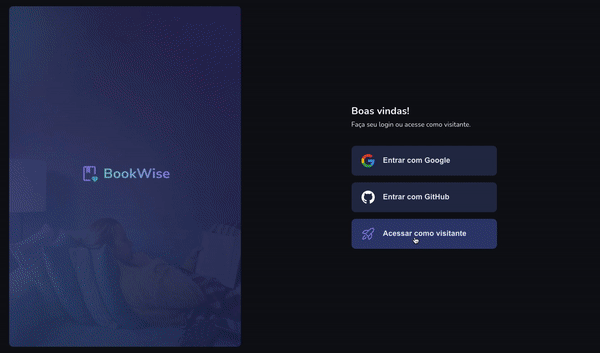

<h1 align='center'>
    
</h1>

<p align="center">A Platform for Readers built with Next.js and Prisma</p>

<p align="center">
   <a href="https://github.com/gustavonobrega">
    
   </a>
</p>

<p align="center">
  
</p>

<hr />

## 🚀 Technologies

This project was developed with the following technologies:

- [Next.js](https://nextjs.org/)
- [TypeScript](https://www.typescriptlang.org/)
- [Stitches](https://stitches.dev/)
- [Radix UI](https://www.radix-ui.com/)
- [Axios](https://axios-http.com/)
- [Prisma](https://www.prisma.io/)
- [Day.js](https://day.js.org/)
- [Next Auth](https://next-auth.js.org/)
- [React Hook Form](https://react-hook-form.com/)
- [Zod](https://zod.dev/)
- [React Query](https://tanstack.com/query/latest/)
- [Phosphor Icon](https://phosphoricons.com/)


## 💻  Getting started

_Before you run this application make sure to copy the `.env.example` file, rename it to `.env` and add all the values for the environment variables.

```bash
# Clone this repository
$ git clone https://github.com/gustavonobrega/bookwise

# Go into the repository
$ cd bookwise

# Install dependencies
$ npm install

# Run the app
$ npm run dev
```

---

Made with ♥ by Gustavo Nobrega